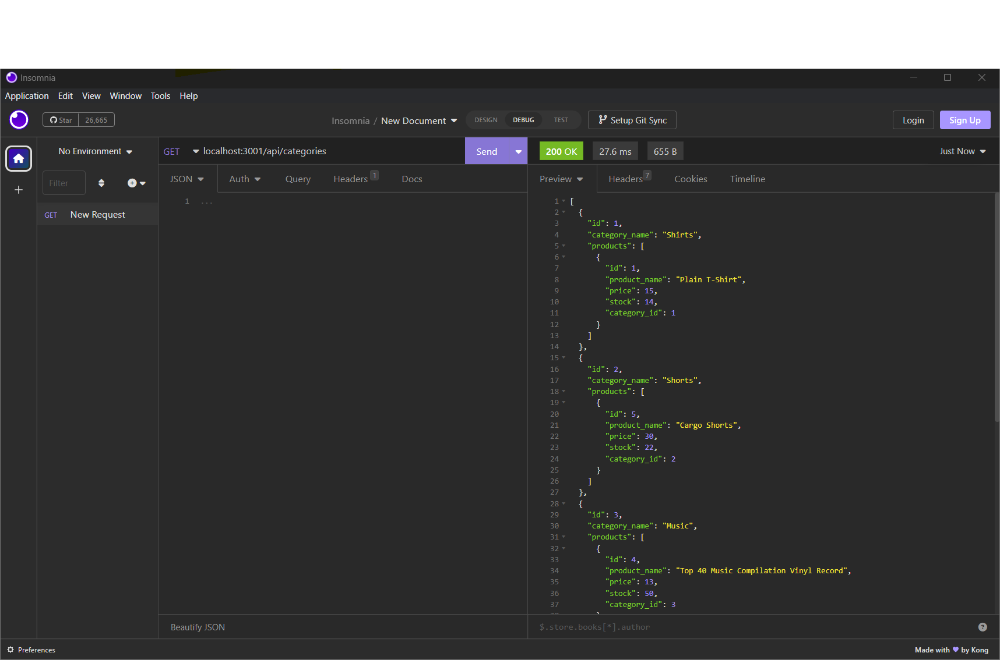
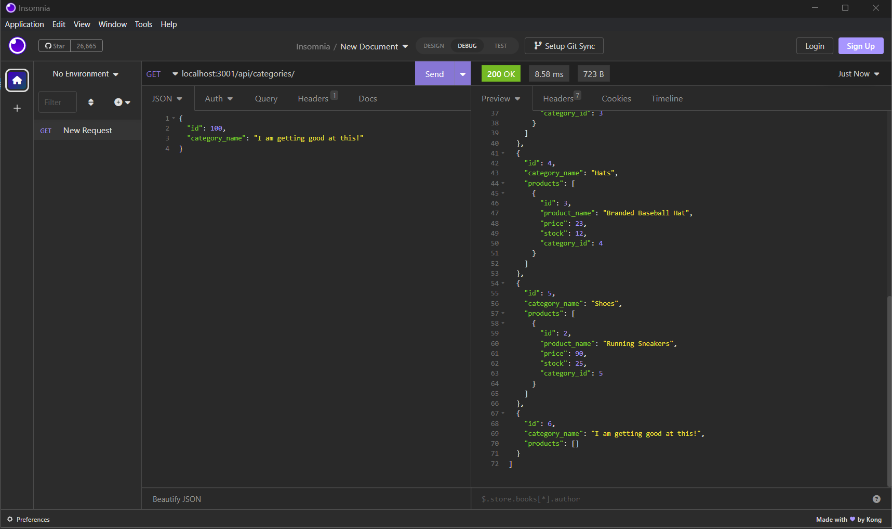
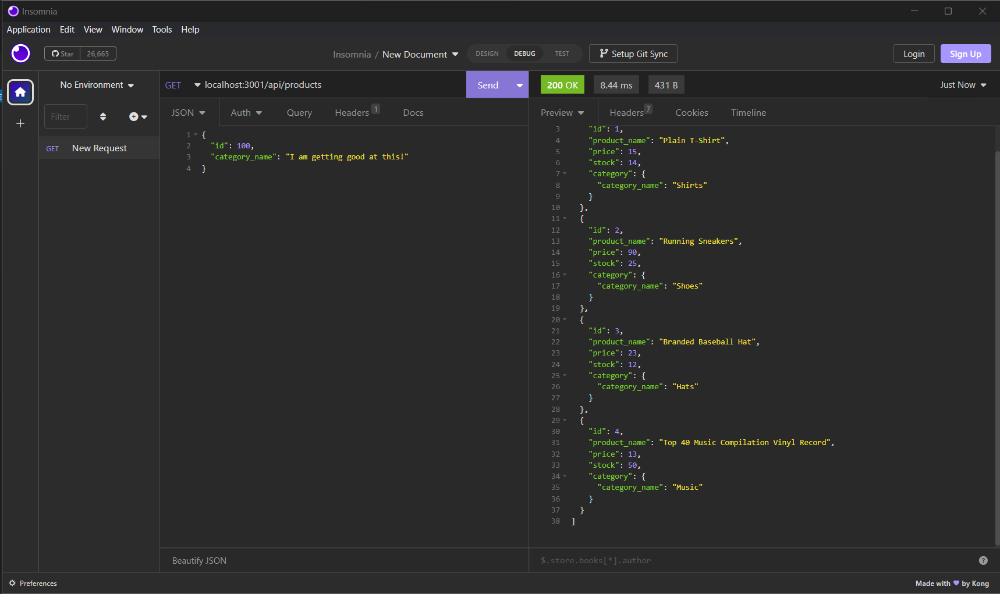

# Commers back end

## Description
This is a back-end project for an e-commerce site. It uses, Express.js API & Sequelize to interact with mySQL database. The CRUD operations is displayed in the walkthrough video.

## Installation
In order for a user to use this application, the user should clone this repository from Github. This application requires Express.js, Node.js, and Sequelize. To connect to the database, run `mysql -u root` and then source the schema. To seed the file then run `npm run seed` in the CLI. And to connect to the server, run `npm server.js`.

### Clone the repository: git clone https://github.com/raminnoorzada/Commerce-back-end.git
Install dependencies: npm install
Seed development database: `npm run seed`
Start the server: `npm start`

## Usage
This application allows users to view, add, edit, and delete categories, products, and tags.

## Test
There are no tests for this application.

## DEMO
[View walkthrough video here 🎥](https://drive.google.com/file/d/1VY4HcEuZXBHlSoBj1JjI-e_SCr1hk7uw/view)

## Screenshots

